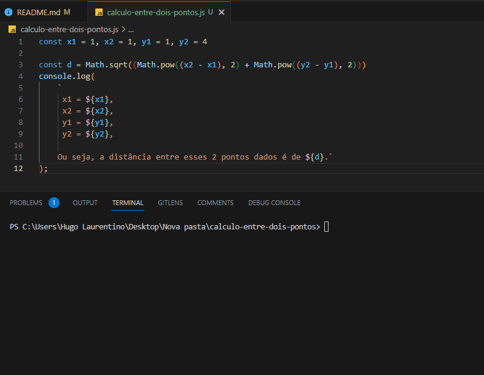

<h1 align="center">
  
</h1>

### Calculo entre dois pontos

- [x] Bak-End
- [x] Criar Título
- [x] Criar Descrição
- [x] Sobre
- [x] Tecnologia
- [x] Pre requisito
- [x] Autor
- [x] GIF‘s
---
<h1 align='center'>Calcular a distância entre dois pontos</h1>

<p align='center'>Esse é um exemplo de logica em javascript</p>

<p align='center'>
	<a href='#sobre'>Sobre</a> |
	<a href='#pré-requisitos'>Pre Requisitos</a> |
	<a href='#tecnologias'>Tecnologias</a> |
	<a href='#autor'>Autor</a>
</p>

---
<h1 align='center'>
	
</h1>

---
### Sobre
  <p align= 'justify'>
    Calcule a distância entre dois pontos utilizando a seguinte fórmula, considerando que (x1, y1) e (x2, y2) sejam dois pontos em um plano:
  </p>

$$ d = \sqrt{(x2 - x1)^2 + (y2 - y1)^2} $$

O seu programa deverá imprimir na tela o resultado **d**

---
### Pré-requisitos 

Antes de começar, você vai precisar ter instalado em sua máquina as seguintes FERRAMENTAS: [GIT](https://git-scm.com/), [Node.js](https://nodejs.org/en/download). 
Além disto é bom ter um editor para trabalhar com o código como [VSCode](https://code.visualstudio.com/download).

### 🎲 Rodando o Back End

```bash
# Clone este repositório
$ git clone https://github.com/hugolaurentino/calculo-entre-dois-pontos.git

# Acesse a pasta do projeto no terminal/cmd
$ cd calculo-entre-dois-pontos

# Instale as dependências
$ npm install

# Execute 
$ node .\calculo-entre-dois-pontos.js

```
### Tecnologias 

As seguintes ferramentas foram usadas na construção do projeto:

- [Node.js][nodejs]
---

## Autor

Feito com ❤️ por Hugo Laurentino 👋🏽 [Entre em contato!](https://www.linkedin.com/in/hugo-laurentino-silva/)

[nodejs]: https://nodejs.org/